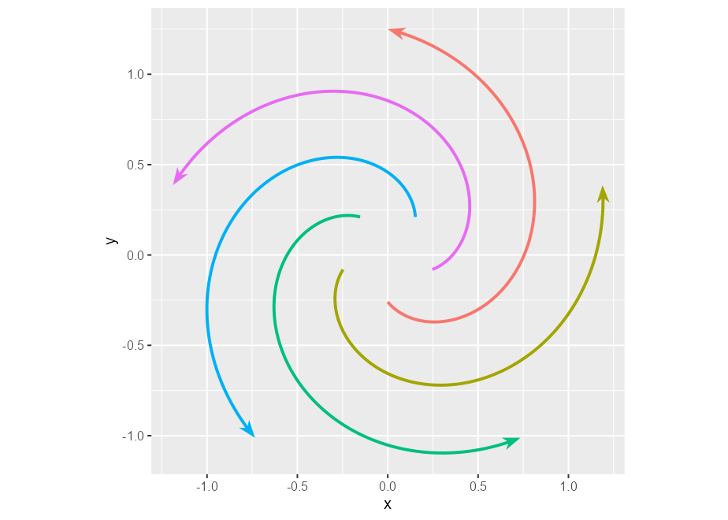
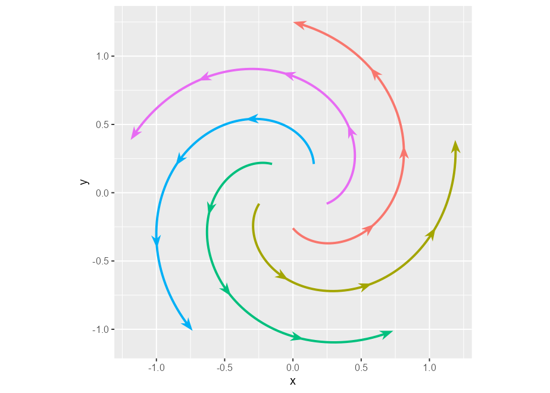
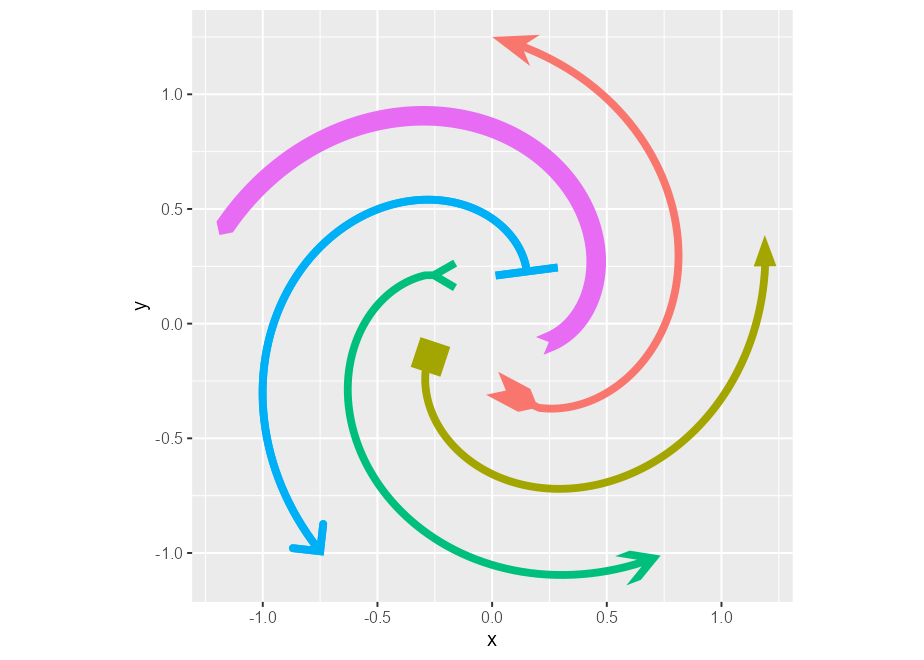
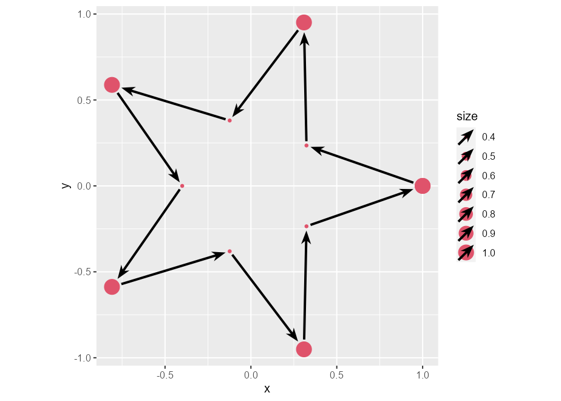

<!-- README.md is generated from README.Rmd. Please edit that file -->

# ggarrow

<!-- badges: start -->

[](https://lifecycle.r-lib.org/articles/stages.html#experimental)
[](https://CRAN.R-project.org/package=ggarrow)
[](https://github.com/teunbrand/ggarrow/actions/workflows/R-CMD-check.yaml)
[](https://app.codecov.io/gh/teunbrand/ggarrow?branch=main)
<!-- badges: end -->

The goal of ggarrow is to draw arrows in
[{ggplot2}](https://ggplot2.tidyverse.org/). It is a [{ggplot2}
extension](https://exts.ggplot2.tidyverse.org/gallery/) package that
focusses on specialised geometry layers to expand the toolkit of arrows.
While you’re reading this, I’ll take this opportunity to inform you that
while this package probably works, it is not very polished.

## Installation

You can install the development version of ggarrow from
[GitHub](https://github.com/) with:

``` r
# install.packages("devtools")
devtools::install_github("teunbrand/ggarrow")
```

## Arrows

They’re made for pointing at things. The workhorse functionality is in
the `geom_arrow()` function that, unsurprisingly, draws arrows. Arrows,
in contrast to vanilla lines, can have variable widths.

``` r
library(ggarrow)
#> Loading required package: ggplot2

p <- ggplot(whirlpool(5), aes(x, y, colour = group)) +
  coord_equal() +
  guides(colour = "none")
p + geom_arrow(aes(linewidth = I(arc))) # Identity scale for linewidth
```



Besides varying linewidths, there is also an option to place arrows
along the path. You could draw arbitrarily many of these, but I doubt
that will look pretty.

``` r
p + geom_arrow(arrow_mid = arrow_head_wings(), mid_place = c(0.25, 0.5, 0.75))
```



You can also tweak what the arrows should look like. The example below
is a bit verbose, but gives an impression of the available options by
combining different styles of arrow heads and what are termed ‘arrow
fins’.

``` r
p + 
  geom_arrow(
    data = ~ subset(.x, group == 1),
    linewidth = 2, 
    arrow_head = arrow_head_wings(),
    arrow_fins = arrow_fins_feather(),
    length_fins = unit(10, "mm")
  ) +
  geom_arrow(
    data = ~ subset(.x, group == 2),
    linewidth = 2, 
    arrow_head = arrow_head_wings(offset = 20, inset = 70),
    arrow_fins = arrow_fins_feather(indent = 0, outdent = 0, height = 1)
  ) +
  geom_arrow(
    data = ~ subset(.x, group == 3),
    linewidth = 2, 
    arrow_head = arrow_head_line(lineend = "parallel"),
    arrow_fins = arrow_fins_line()
  ) +
  geom_arrow(
    data = ~ subset(.x, group == 4),
    linewidth = 2, 
    arrow_head = arrow_head_line(45, lineend = "round"),
    arrow_fins = arrow_fins_line(90)
  ) +
  geom_arrow(
    data = ~ subset(.x, group == 4),
    linewidth = 2, 
    arrow_head = arrow_head_line(45, lineend = "round"),
    arrow_fins = arrow_fins_line(90)
  ) +
  geom_arrow(
    data = ~ subset(.x, group == 5),
    linewidth = 5, 
    arrow_head = arrow_head_minimal(),
    arrow_fins = arrow_fins_minimal()
  )
```



There are some other geoms that mimic bread-and-butter ggplot2 layers,
such as `geom_arrow_segment()` and `geom_arrow_curve()`, that add the
same arrow functionality on top of the `geom_segment()` and
`geom_curve()` layers.

Aside from these, there is also `geom_arrow_chain()`, which has no
equivalent in vanilla ggplot2. It adds arrows in between points, and
dodges the endpoints a bit so that they don’t seem to touch. In the
example below, we can see that we can dodge points of different sizes.

``` r
t <- seq(0, 2 * pi, length.out = 11)
l <- rep(c(1, 0.4), length.out = 11)

df <- data.frame(
  x = cos(t) * l,
  y = sin(t) * l,
  size = l
)

ggplot(df, aes(x, y, size = size)) +
  geom_point(colour = 2) +
  geom_arrow_chain() +
  coord_equal()
```



## Dependency statement

The {ggarrow} package largely takes on the same dependencies as
{ggplot2} to keep it on the lightweight side. However, this package
wouldn’t work at all without the {polyclip} dependency, which is the
only one outside {ggplot2}’s imports.

## Related work

Of course, the {grid} package, on which {ggplot2} is build upon, offers
some options for arrows. Both the
[{gggenes}](https://wilkox.org/gggenes/) and
[{gggenomes}](https://thackl.github.io/gggenomes/) packages use arrows
in a domain-specific context. For vector field visualisation, there is
the [{ggquiver}](http://pkg.mitchelloharawild.com/ggquiver/) package.
The [{ggarchery}](https://github.com/mdhall272/ggarchery) package also
provides extended options for the `geom_segment()` parametrisation of
lines.
