# Customising arrows

There are a few ways in which one can tweak the display of arrow
ornaments in ggarrow. This vignette goes through a few methods for
making new arrow ornaments, from basic xy-coordinates to function
factories and using the ornaments in scales.

### New ornaments

In principle, extending ornaments is as straightforward as being able to
construct a polygon in an xy-coordinate matrix with `x` as the first
column and `y` as the second column.

``` r

my_ornament <- function(n = 5) {
  t <- seq(0, 2 * pi, length.out = n * 2 + 1)[-(n * 2 + 1)]
  l <- rep(c(1, 0.4), length.out = length(t))

  cbind(
    x = cos(t) * l,
    y = sin(t) * l
  )
}
```

We can inspect the coordinates of our new ornament. It is ggarrow’s
convention that the line joins the ornament at the (0,0) coordinate.
Also, the tip of the ornament is expected to be at the (1,0) coordinate.

``` r

orn <- my_ornament(5)

plot_ornament(orn)
```

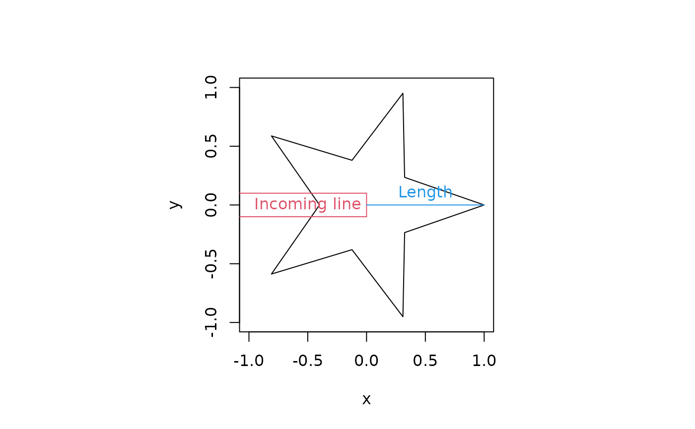

You can now use your ornament as the `arrow_head`, `arrow_fins` and
`arrow_mid` arguments. It just listens to the usual arguments like
`length_{head/fins/mid}`, `resect_{head/fins}` and `mid_place` and
scales with the line width (if the length is not an absolute unit).

``` r

library(ggarrow)
#> Loading required package: ggplot2

ggplot(data = data.frame(x = c(0, 1)), aes(x = x)) +
  geom_arrow(aes(y = c(1, 3)), arrow_head = orn, resect = unit(2, "cm")) +
  geom_arrow(aes(y = c(2, 2)), arrow_fins = orn, length_fins = unit(1, "cm")) +
  geom_arrow(aes(y = c(3, 1)), arrow_mid  = orn, mid_place = c(0.33, 0.66),
             linewidth = 2)
```

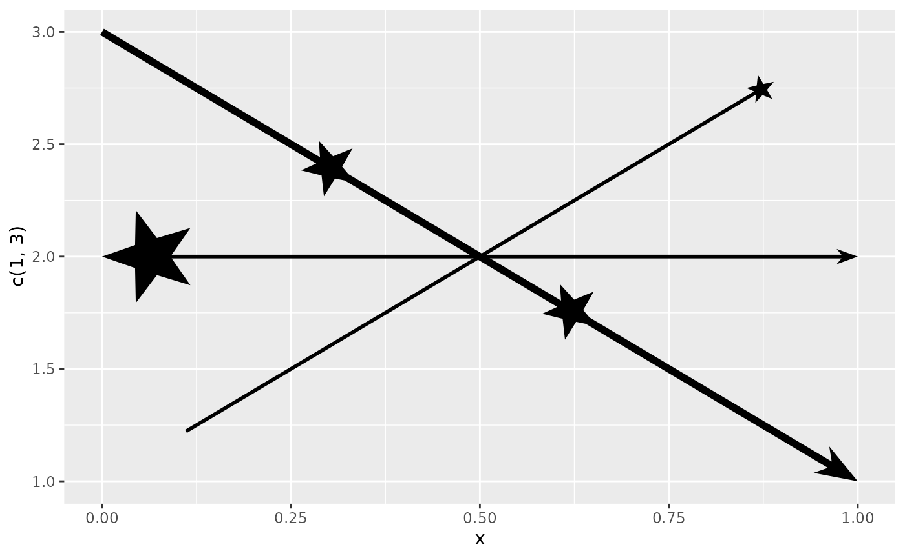

### Ornament factories

Sometimes, you might want to know more about the context in which you’re
drawing the ornament than can’t be known before plotting. For example,
let’s say we wanted to add half the star we made above an arrowhead.
When doing this it is immediately clear that the connection with the
line looks awful.

``` r

half_star <- orn[orn[, "y"] >= 0, ]

ggplot(data.frame(x = c(0, 1), y = c(1, 1)), aes(x, y)) +
  geom_arrow(arrow_head = half_star, linewidth = 3)
```


If we know the linewidth in advance, you might nudge it manually.
Because the default `length_head` is 4 and the we set the linewidth is
3, the arrowhead will get a size of 3 \* 4 = 12 mm.

``` r

magic_number <- 0.7528125
half_star[, "y"] <- half_star[, "y"] - (1.5 / 12) * magic_number

ggplot(data.frame(x = c(0, 1), y = c(1, 1)), aes(x, y)) +
  geom_arrow(arrow_head = half_star, linewidth = 3)
```

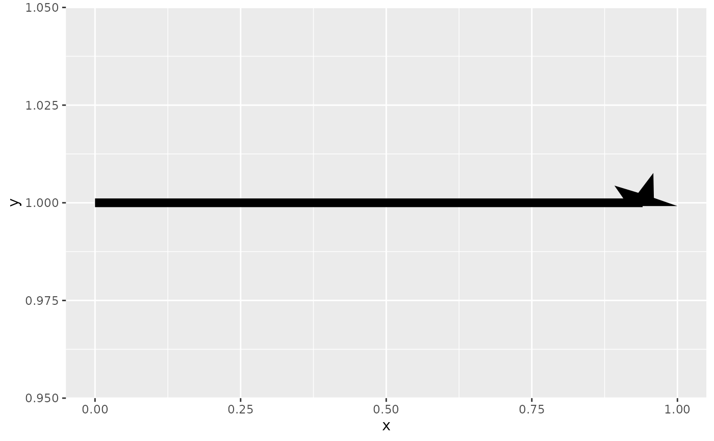

The way to solve this, is to use a function factory. This method is much
more involved, so be forewarned. First, if we just write a function that
does as we did before, you might notice a *tiny* star at the end of the
line as a few pixels.

``` r

half_star <- function(n = 5) {
  ornament <- my_ornament(n)
  function(...) {
    half <- ornament[ornament[, "y"] >= 0, ]
    half
  }
}

ggplot(data.frame(x = c(0, 1), y = c(1, 1)), aes(x, y)) +
  geom_arrow(arrow_head = half_star(5), linewidth = 3)
```

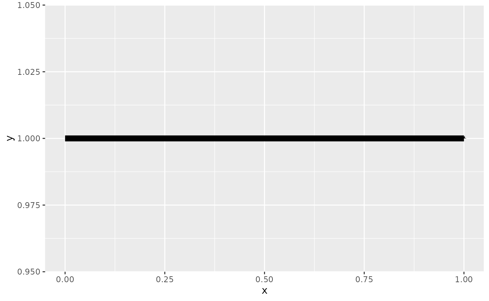

That is because the output of the function factory gets interpreted as
millimetres. To be responsive to what `length_head` is being passed
around, you should multiply your output with the length. `length` is one
of the parameters that the function produced by the factory can receive.
Doing this gives more reasonable output, but we can now see that the
half-star extends beyond the path’s end.

``` r

half_star <- function(n = 5) {
  ornament <- my_ornament(n)
  function(length, ...) {
    half <- ornament[ornament[, "y"] >= 0, ]
    half * length
  }
}

ggplot(data.frame(x = c(0, 1), y = c(1, 1)), aes(x, y)) +
  geom_arrow(arrow_head = half_star(5), linewidth = 3)
```

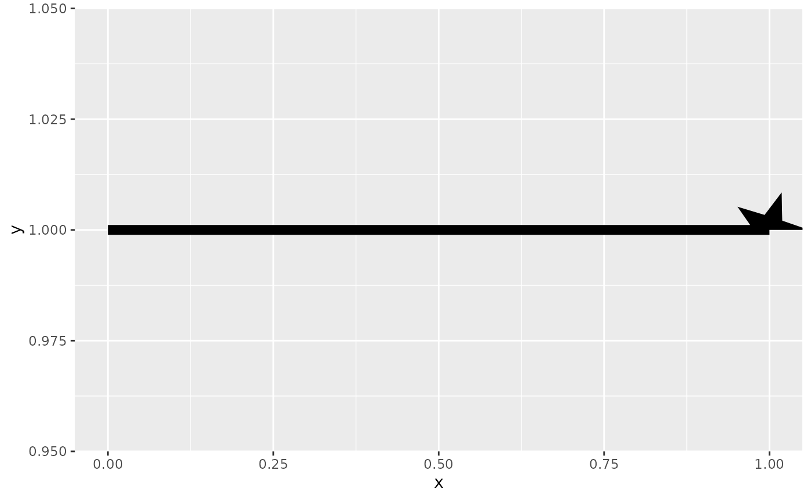

To control how much the line should be cut back, you can set the
‘resect’ attribute on your output. For this shape, we should probably
resect the line by exactly the length parameter we get. Now the
alignment looks correct.

``` r

half_star <- function(n = 5) {
  ornament <- my_ornament(n)
  function(length, ...) {
    half <- ornament[ornament[, "y"] >= 0, ]
    half <- half * length
    attr(half, "resect") <- length
    half
  }
}

ggplot(data.frame(x = c(0, 1), y = c(1, 1)), aes(x, y)) +
  geom_arrow(arrow_head = half_star(5), linewidth = 3)
```


Lastly, to fix the actual problem we were trying to solve, we can nudge
the y-coordinates by half the linewidth. `width` is a parameter the
produced function can receive that represents the line width. Now, it
looks like it should.

``` r

half_star <- function(n = 5) {
  ornament <- my_ornament(n)
  function(length, width, ...) {
    half <- ornament[ornament[, "y"] >= 0, ]
    half <- half * length
    half[, "y"] <- half[, "y"] - 0.5 * width
    attr(half, "resect") <- length
    half
  }
}

df <- expand.grid(x = c(0, 1), width = 1:4)

ggplot(df, aes(x, width, linewidth = I(width), group = width)) +
  geom_arrow(arrow_head = half_star(5)) +
  ylim(0, 5)
```

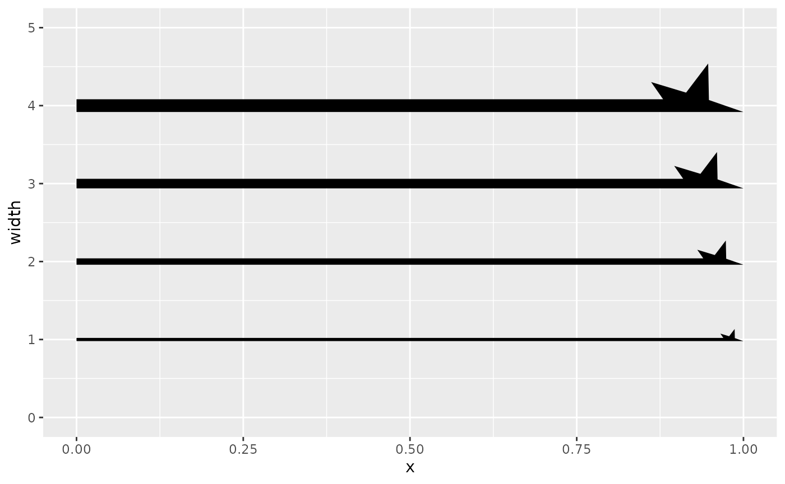

Besides `width` and `length`, the inner function can also receive
`resect`. Because functionality might be expanded in the future, the
last argument to the inner function should be `...`.

### Shafts

While arrow heads and fins are all the rage, shafts can also be
customised to some degree.

#### Line types

As one might expect from lines in R, you can use different line types.
They work the same as elsewhere in ggplot2.

``` r

p <- ggplot(whirlpool(5), aes(x, y, group = group)) +
  coord_equal()

p + geom_arrow(aes(linetype = factor(group)))
```


#### Variable width

In addition to line types, lines can have variable widths. Contrary to
[`geom_line()`](https://ggplot2.tidyverse.org/reference/geom_path.html),
which cuts up lines into segments between vertices,
[`geom_arrow()`](https://teunbrand.github.io/ggarrow/reference/geom_arrow.md)
supports veritable variable widths. This only works with solid line
types. I have not been able to envision variable width dashed lines.

``` r

p + 
  geom_arrow(
    aes(linewidth = I(arc)),
    linetype = "solid" # only supported line type
  )
```

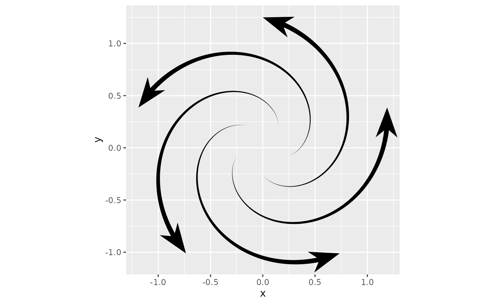

#### Distortion

A hitherto foreign-ish concept for line types in R is what we here call
‘distortions’. These distortions create a line-based pattern that
repeats along the shaft of an arrow. We have a few named distortions,
`"sinewave"`, `"sawtooth"` and `"squarewave"` that you can use out of
the box. Note that these are *parameters* and not *aesthetics*, so they
apply to every arrow in the layer.

``` r

p + geom_arrow(distort = "sinewave")
```

 These named
distortions refer to a family of functions, which you can also use to
parametrise the distortion. For example, if you want to change the
wavelength/frequency and amplitude of the sine waves, you’d use the
function instead of the name.

``` r

p + geom_arrow(distort = distort_sinewave(length = 2, width = 5))
```

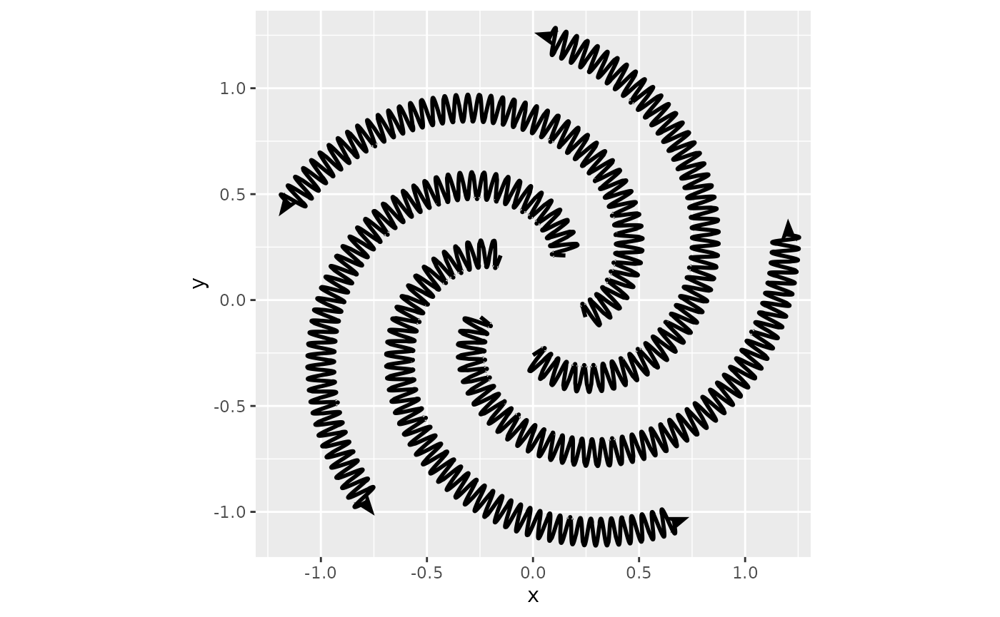

These functions produce 2-column matrices describing oscillations. The
matrices have a row for each vertex in a distortion. The values in these
matrices are interpreted in millimetres. The first column in the
coordinate along the shaft, whereas the second column is the coordinate
orthogonal to the shaft. We always attempt to smush an exact integer of
oscillations along the shaft, so please interpret the numbers more as
suggestions than hard truths.

``` r

distort_sawtooth()
#>      x  y
#> [1,] 0  0
#> [2,] 1  1
#> [3,] 3 -1
#> [4,] 4  0
#> attr(,"size")
#> [1] 4
```

This means that you can substitute our boring templated distortion
patterns with your own exciting distortions. The distortion
functionality expects the first coordinate to be at (0, 0) and the last
coordinate to be at (wavelength, 0). For example we can make this
oscillation:

``` r

oscillation <- matrix(
  cbind(
    c(0, 0, 4, 4, 2, 2, 3, 3, 1, 1, 5, 5),
    c(0, -2, -2, 1, 1, 0, 0, -1, -1, 2, 2, 0)
  ), 
  ncol = 2
)

plot(oscillation, type = 'l')
```

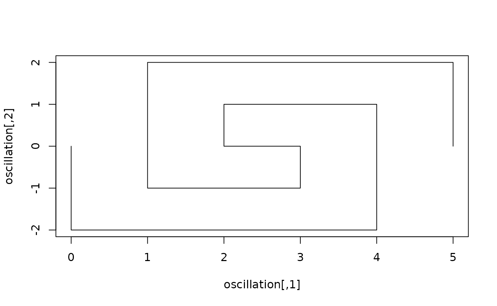

Which displays thusly:

``` r

p + geom_arrow(distort = oscillation)
```

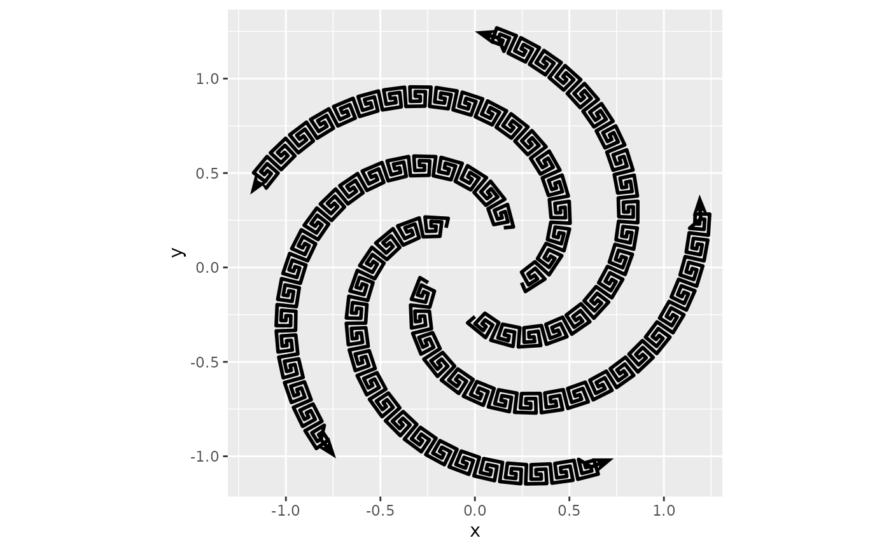

There are two reasons why you might want to pack up your own
oscillations in a function. The first is that you might want to
parametrise your oscillations. The second is that you might want to
refer to these by name. The `distort` argument recognises a
`distort_`-prefix, which you can use to name your own oscillations.

``` r

distort_greek <- function(size = 5) {
  matrix(
    cbind(
      c(0, 0, 4, 4, 2, 2, 3, 3, 1, 1, 5, 5),
      c(0, -2, -2, 1, 1, 0, 0, -1, -1, 2, 2, 0)
    ), 
    ncol = 2
  ) * size / 5
}

p + geom_arrow(distort = "greek")
```


### Scales

The discrete scales in ggarrow can take a mixed list of things that may
define an arrow. That way, you can just put your own ornaments in a list
to have it become part of the scale.

``` r

p <- ggplot(whirlpool(5), aes(x, y, group = group)) +
  coord_equal()

p + geom_arrow(aes(arrow_head = group), resect = 5) +
  scale_arrow_head_discrete(
    values = list("head_wings", orn, "fins_feather", orn, "cup"),
  )
```

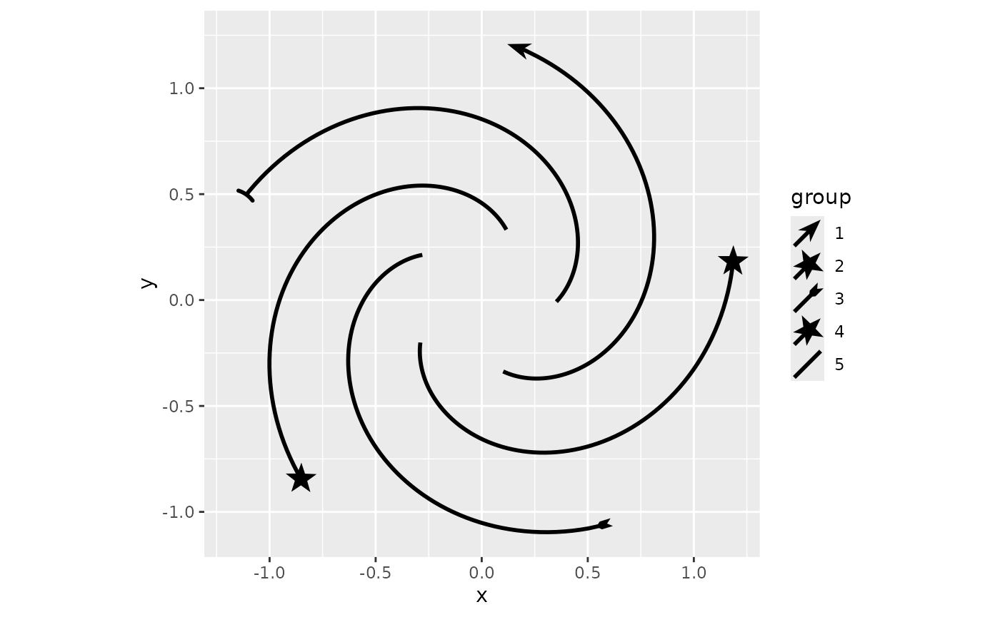

If you start your function name with the `arrow_`-prefix, the ornament
can be automatically found if available in the global environment.

``` r

arrow_star <- function(n = 5) {
  my_ornament(round(n))
}

p + geom_arrow(aes(arrow_head = group), resect = 1) +
  scale_arrow_head_discrete(
    values = c("head_wings", "star", "fins_feather", "star", "cup"),
  )
```


While not always very easy to figure out, as different arrowheads are
discrete, one *can* in theory also apply a continuous scale to arrows.
Please note that I sneaked in a
[`round()`](https://rdrr.io/r/base/Round.html) in the function above,
this is so that we can demonstrate a continuous scale with the star.

If we have something about our arrowhead that may vary in number, like
an angle, or some size or in this example, the number of points on a
star (though not *truly* continuous), we can use
[`scale_arrow_head_continuous()`](https://teunbrand.github.io/ggarrow/reference/continuous_arrow_scales.md)
to map our variable to the arrowhead. We should give the function we
created as the `generator` argument. The variable part of our function
argument should be provided as `map_arg`, and the range of values it can
take on should be provided as `range`.

``` r

p + geom_arrow(aes(arrow_head = as.integer(group)), resect = 5) +
  scale_arrow_head_continuous(
    generator = arrow_star, map_arg = "n",
    range = c(3, 7)
  )
```

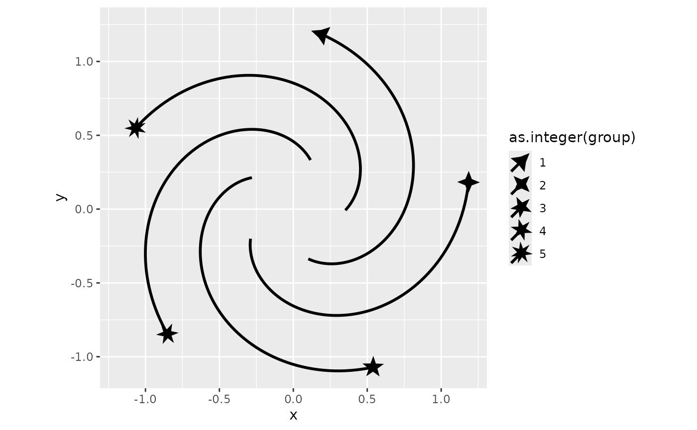
