# Arrow Ornaments

Arrow ornaments come in two main varieties: head ornaments and fins
ornaments. These are respectively placed at the end and start of a line.
This vignette introduces the built-in arrow ornaments.

## Head ornaments

Head ornaments are the ‘arrowhead’ ornaments at the end of a line.

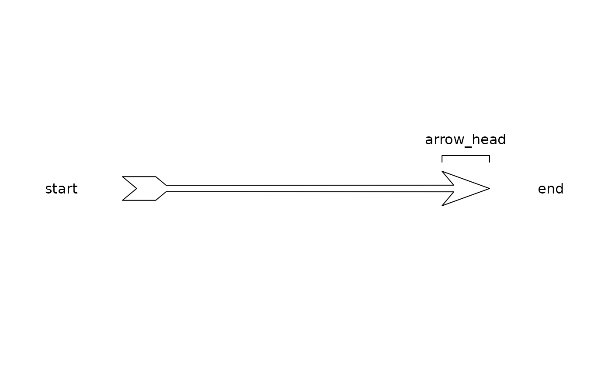

### Wings

The ‘wings’ ornament places two symmetric triangles on either side of
the line, and can be called using the
[`arrow_head_wings()`](https://teunbrand.github.io/ggarrow/reference/arrow_ornaments.md)
function. The `offset` parameter determines at what angle the triangle
departs from the line end. The `inset` parameter determines the angle
inside the corner that is not on the line. If you ensure that
`inset + offset` equals 90, you can mimic
`grid::arrow(..., type = "closed")` (2nd example). The `length_head`
arguments determines the distance between the red line at the arrow tip
and the blue line, where the triangle re-joins the line.

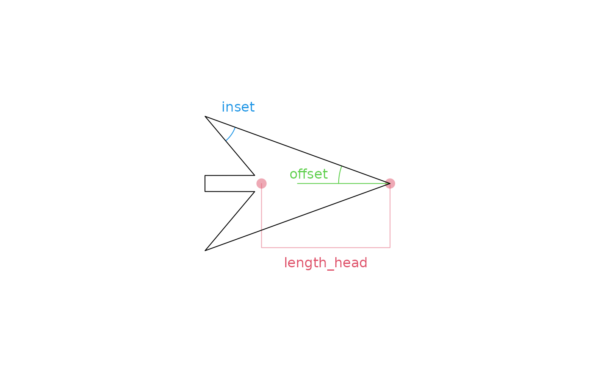

Below you can get an impression what kinds of shapes you can make with
the wings arrowhead.

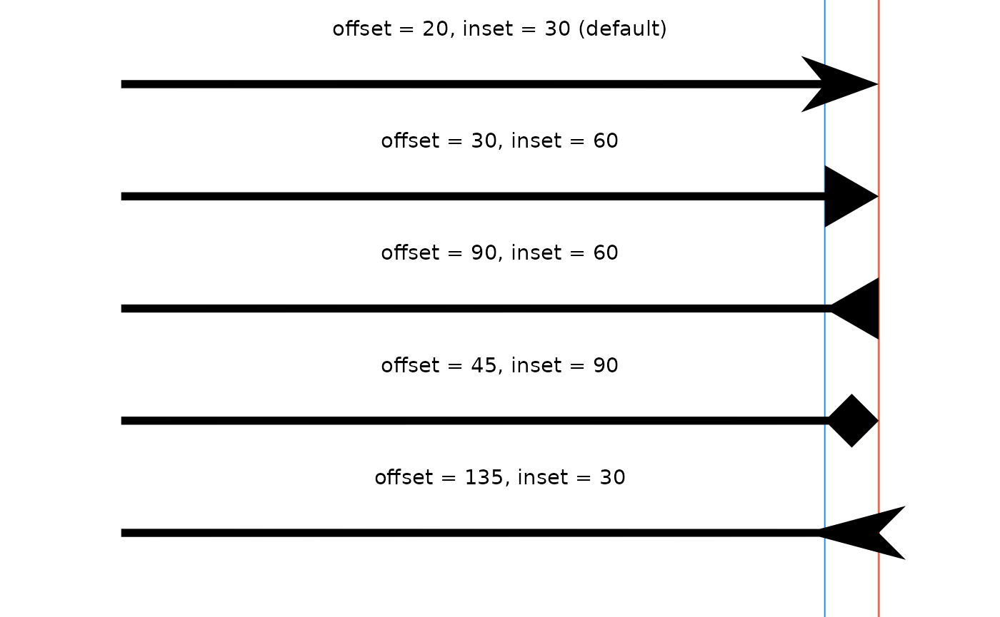

### Line

The ‘line’ ornament draws two line segments departing from the line end,
and can be set using the
[`arrow_head_line()`](https://teunbrand.github.io/ggarrow/reference/arrow_ornaments.md)
function. The `linewidth` aesthetic determines the thickness of the
departing line, in that the line width is the same between the path and
the ornament. The size of the arrow is once again determined by the
`length_head` argument, but now encompasses the length of the protruding
lines instead of the reconnection point back on the path.

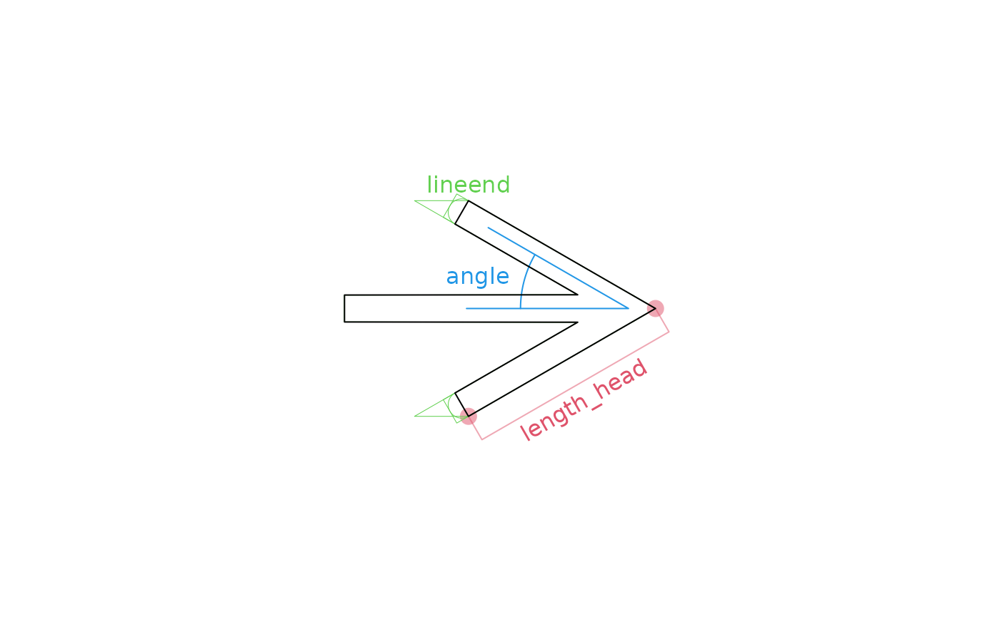

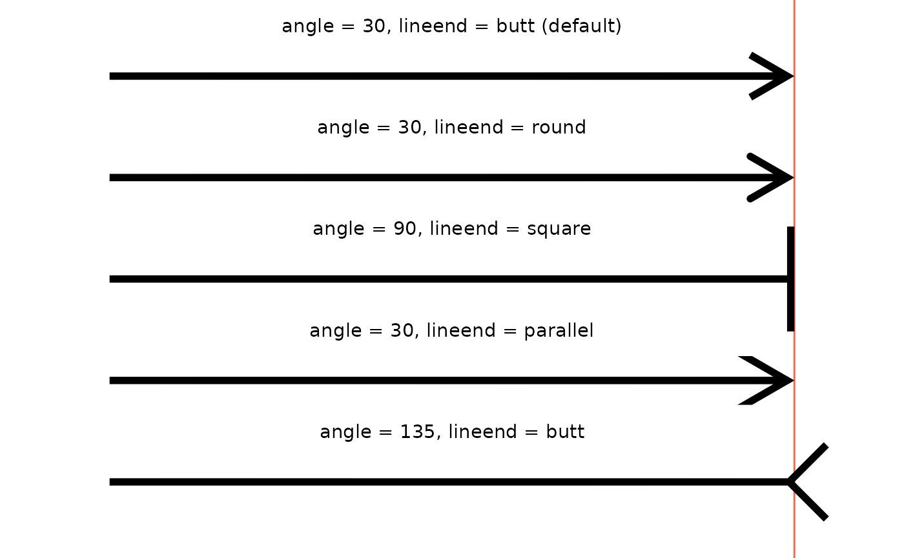

### Minimal

The ‘minimal’ ornament isn’t truly an ornament, but determines how the
arrow shaft gets notched. Therefore, it is independent of any
`length_head` you might set, and is only dependent on the `angle`
argument and the `linewidth` aesthetic.

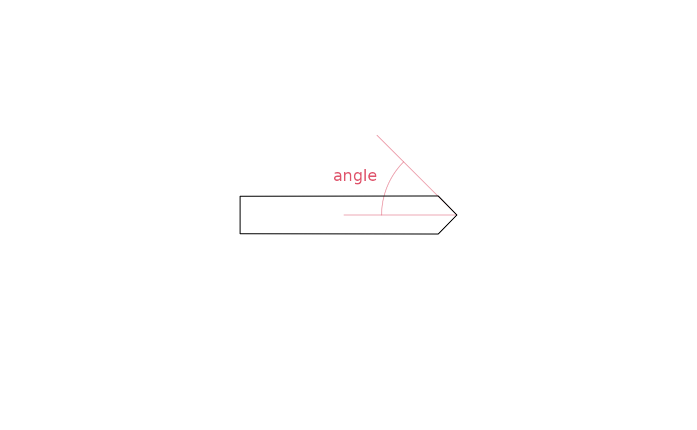

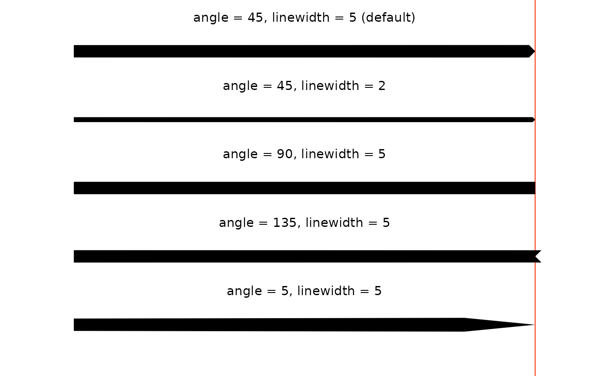

## Fins ornaments

I haven’t bothered writing the vignette on these other ones yet.

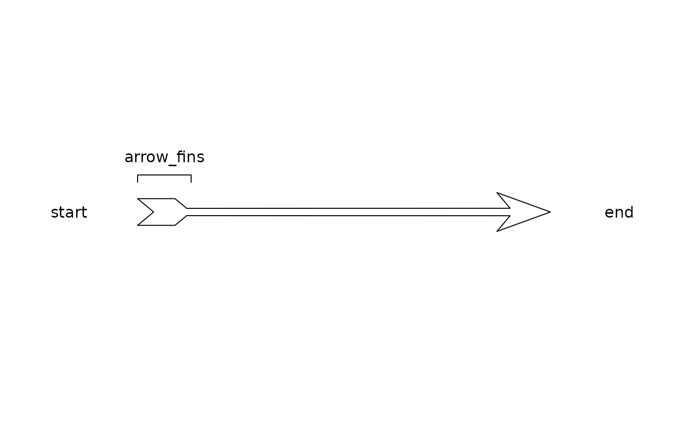

### Feather

The ‘feather’ ornament places two trapeziums on either side of the line,
and can be called using the
[`arrow_fins_feather()`](https://teunbrand.github.io/ggarrow/reference/arrow_ornaments.md)
function. Contrary to many other ornaments, the feather ornament isn’t
defined by any angle. It is instead defined by the ‘height’ of the
trapezium and the distances along the path from the inner start and end
points to the outer ones called ‘indent’ and ‘outdent’. The
`length_fins` argument determines the total width of the trapezium.

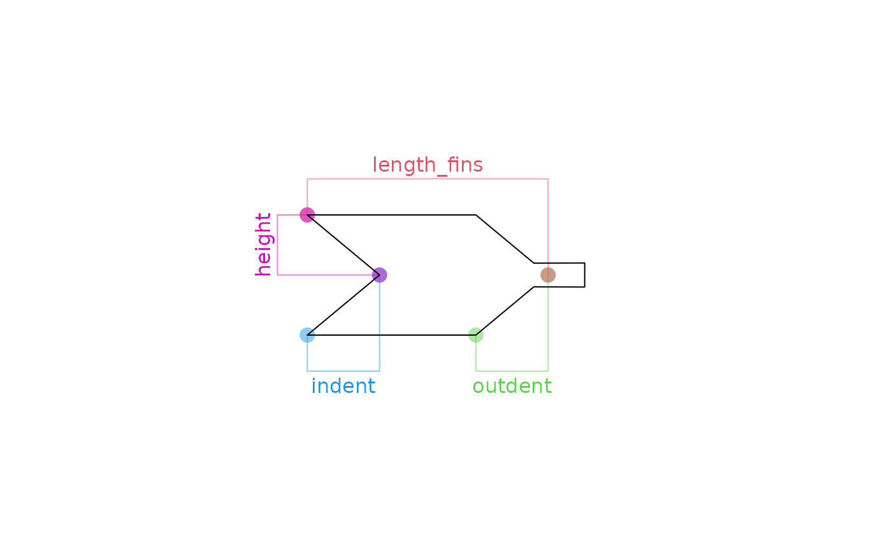

Below are some examples of what different settings look like with this
ornament.

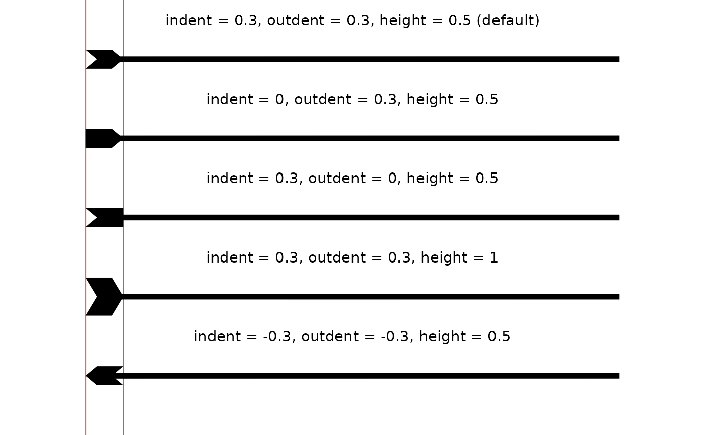

### Line

The ‘line’ fins ornament mirrors the ‘line’ head ornament: it draws two
line segments departing from the line end and can be set using the
[`arrow_fins_line()`](https://teunbrand.github.io/ggarrow/reference/arrow_ornaments.md)
function. Again, the `linewidth` aesthetic determines the thickness of
the departing line, in that the line width is the same between the path
and the ornament. This size of the arrow is determined by the
`length_fins` argument, but in contrast to
[`arrow_fins_line()`](https://teunbrand.github.io/ggarrow/reference/arrow_ornaments.md),
the `length_fins` argument applies to the inner edge. Also in contrast,
the `angle` is measured from the extended path to the lines, rather than
from the path itself.

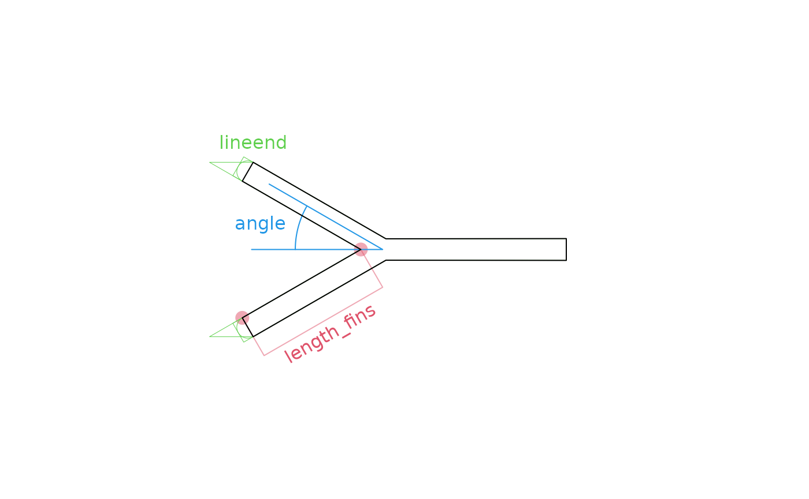

Another notable difference is that in
[`arrow_fins_line()`](https://teunbrand.github.io/ggarrow/reference/arrow_ornaments.md)
the most extreme parts are at the path’s end and don’t protrude beyond.
For comparison, take a look at the 5th example in
[`arrow_head_line()`](https://teunbrand.github.io/ggarrow/reference/arrow_ornaments.md)
and the first 4 examples below:

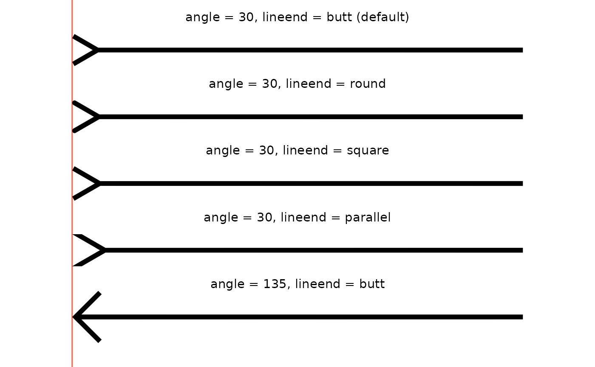

### Minimal

The ‘minimal’ fin ornament again isn’t truly an ornament, but it
determines how the arrow shaft gets notched. Like
[`arrow_head_minimal()`](https://teunbrand.github.io/ggarrow/reference/arrow_ornaments.md),
[`arrow_fins_minimal()`](https://teunbrand.github.io/ggarrow/reference/arrow_ornaments.md)
doesn’t depend on any `length_fins` you might set and only depends on
the `angle` argument and the `linewidth` aesthetic. The only difference
between
[`arrow_head_minimal()`](https://teunbrand.github.io/ggarrow/reference/arrow_ornaments.md)
and
[`arrow_fins_minimal()`](https://teunbrand.github.io/ggarrow/reference/arrow_ornaments.md),
is what part is considered the `angle`.

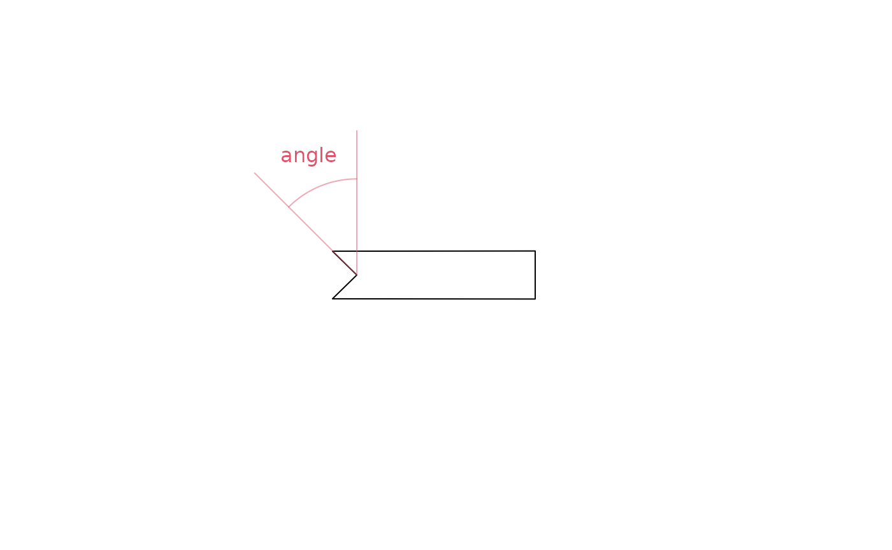

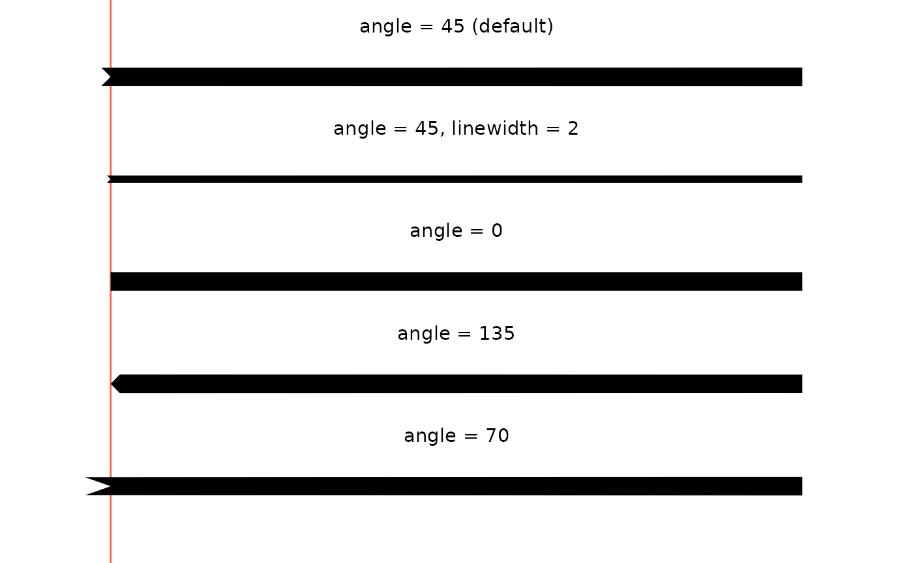

## Other ornaments

### Cups

Not more suitable for arrow head than for fins, the ‘cup’ ornament may
fit both ends of a path. The cup shape can be specified using the
[`arrow_cup()`](https://teunbrand.github.io/ggarrow/reference/arrow_ornaments.md)
function and it follows a circular arc around the endpoint of a path at
some distance given by the `resect` parameter. There are two ways these
cups can be specified. The first one is by the angle or the arc, which
can be given by using the `arrow_cup(angle = ...)` function. If the
angle is left as `NULL`, the ornament looks for the `length_{head/fins}`
and uses that as the arc-length to draw the arc, which is the second
specification.

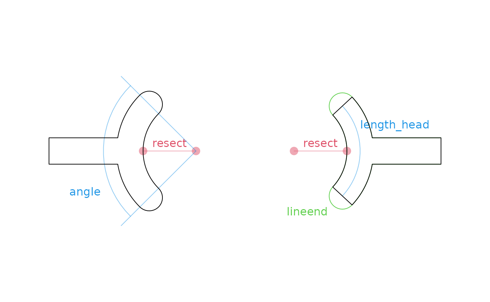

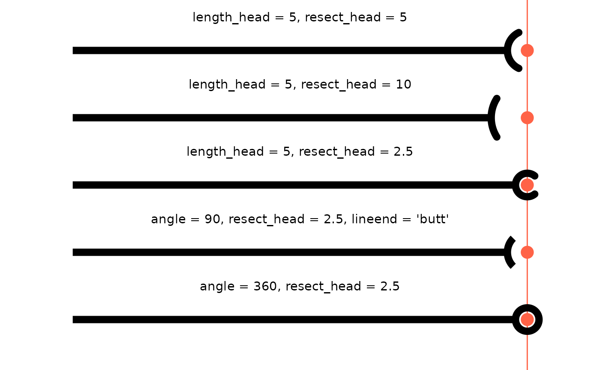

The cup shape can make it easier to single out some observations from
the rest.

``` r

ggplot(mtcars, aes(disp, mpg)) +
  geom_point(aes(colour = factor(cyl))) +
  geom_arrow_curve(
    data = ~ subset(.x, rownames(.x) == "Hornet 4 Drive"),
    aes(xend = 300, yend = 25),
    arrow_fins = arrow_cup(angle = 360), resect_fins = 1.5
  ) +
  annotate(
    "text", x = 300, y = 25,
    label = "Hornet 4 Drive",
    vjust = -1
  )
```

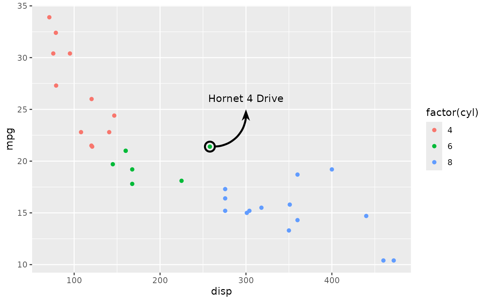
