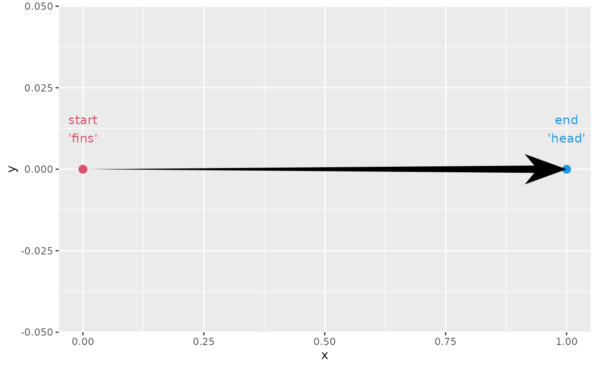
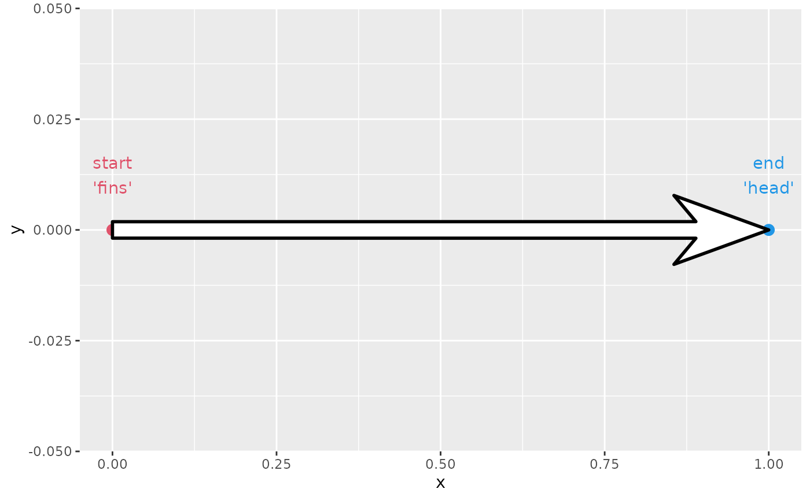
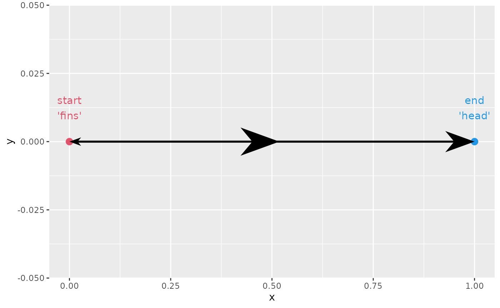
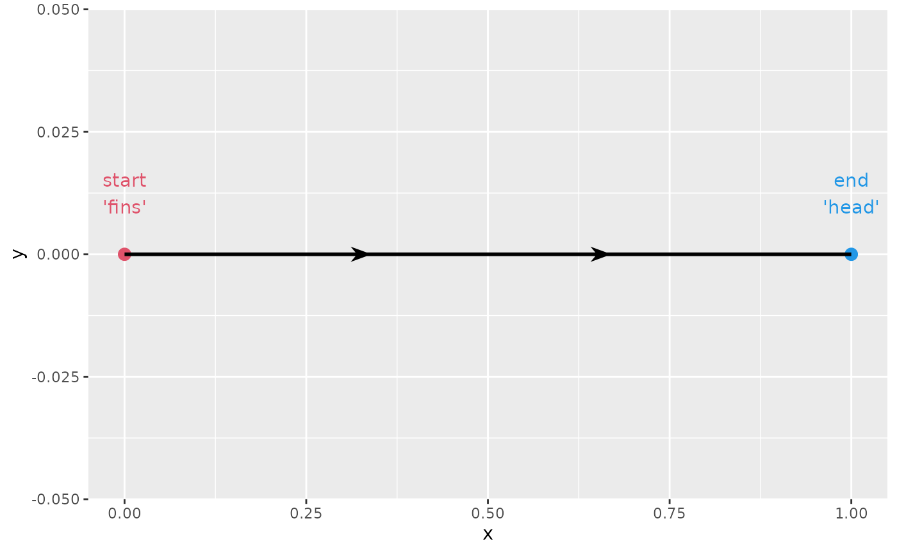
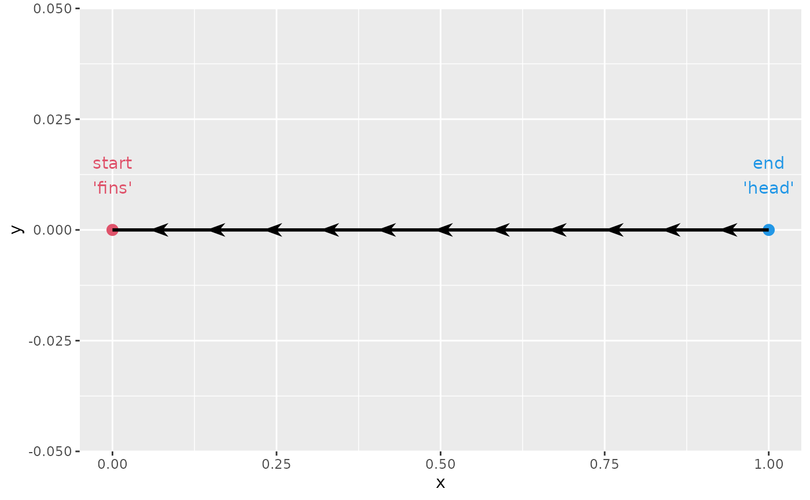
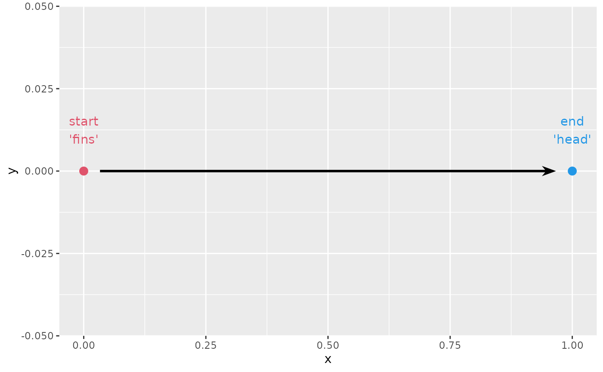
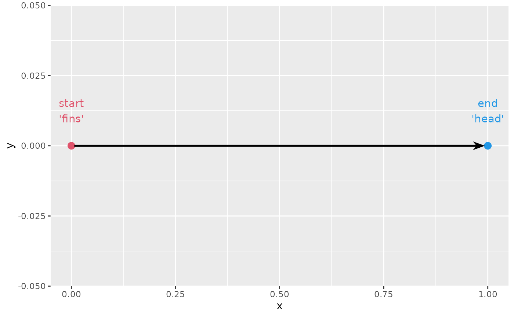
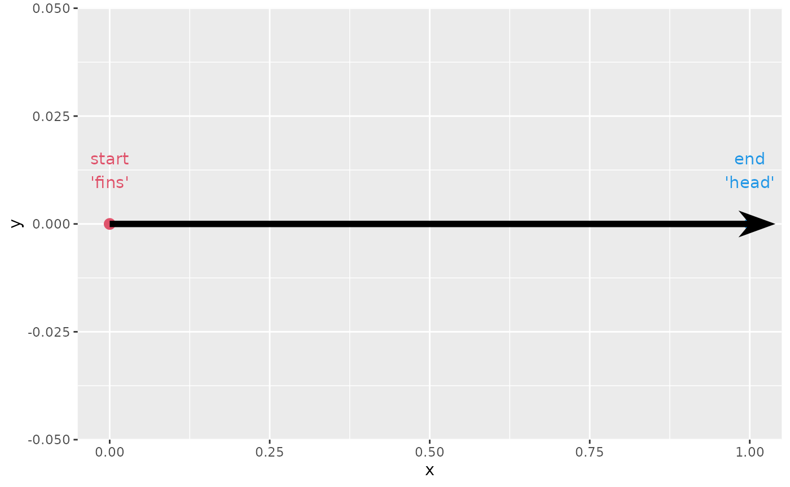
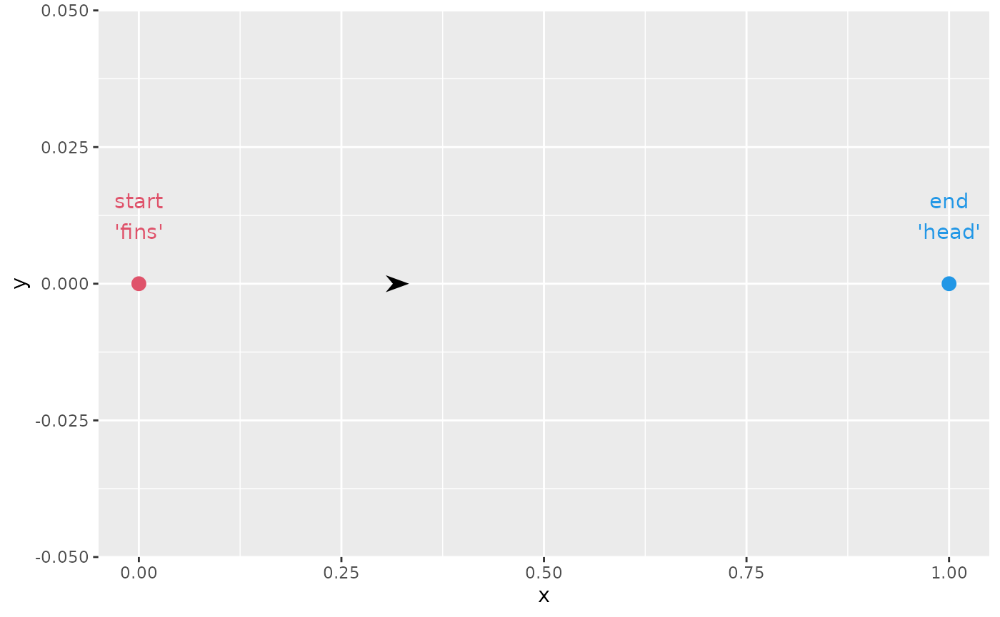
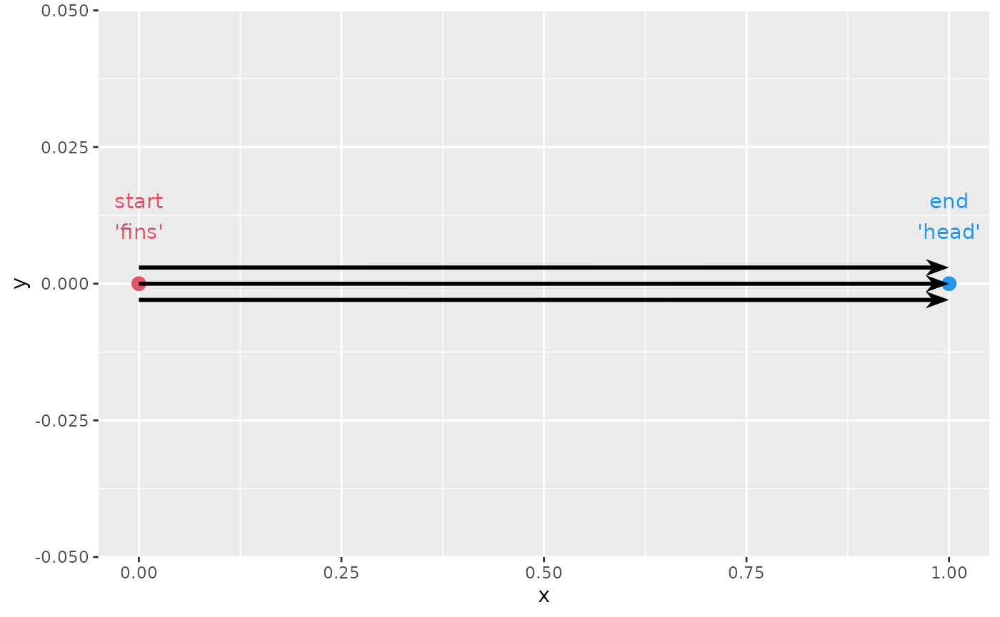

# Arrow parameters

This vignette walks through the various options present in
[`geom_arrow()`](https://teunbrand.github.io/ggarrow/reference/geom_arrow.md)
and friends. First, let’s setup a very basic plot in which we can show
what the parameters are doing.

``` r

library(ggarrow)
#> Loading required package: ggplot2

p <- ggplot(data.frame(x = c(0, 1), y = 0), aes(x, y)) +
  geom_point(colour = c(2, 4), size = 3) +
  geom_text(
    aes(label = c("start\n'fins'", "end\n'head'")),
    colour = c(2, 4), vjust = -1
  )
```

## Aesthetics

There are 3 aesthetics that depart from the typical
[`geom_path()`](https://ggplot2.tidyverse.org/reference/geom_path.html)
behaviour. The first one is the `linewidth` aesthetic, in that it can
vary within a path.

``` r

p + geom_arrow(linewidth = c(0, 3))
```



This all means that you could in theory display a kernel density
estimate using an arrow, by remapping a computed density aesthetic to
the linewidth.

``` r

ggplot(faithful, aes(waiting)) +
  geom_arrow(
    stat = "density",
    aes(y = after_stat(0),
        linewidth = after_scale(ndensity * 20))
  )
```


The other two are the `stroke_colour` and `stroke_width` aesthetics.
These can be used to outline the arrow.

``` r

p + geom_arrow(stroke_colour = "black", stroke_width = 1,
               colour = "white", linewidth = 5)
```



## Heads, fins and middle arrows

This dealt with more thoroughly in another vignette. To briefly recap,
an arrow comes in three parts: a head, a shaft and fins. All these parts
are valid places to place ornaments.

### Using arrow parts

The three different parts of an arrow can be populated with the
`arrow_head`, `arrow_fins` and `arrow_mid` arguments. Whereas
`arrow_head` and `arrow_fins` are pointed towards their respective path
ends, the `arrow_mid` follows the forward orientation.

``` r

p + geom_arrow(
  arrow_head = arrow_head_wings(),
  arrow_mid  = arrow_head_wings(),
  arrow_fins = arrow_head_wings()
)
```


### Setting sizes

The arrow sizes can be controlled by the `length_head`, `length_fins`
and `length_mid` arguments. You can use a plain `<numeric>` to have the
arrow size be relative to the `linewidth` aesthetic. Alternatively, you
set the length in an absolute manner by providing a `<grid::unit>`
object.

``` r

p + geom_arrow(
  arrow_head = arrow_head_wings(),
  arrow_mid  = arrow_head_wings(),
  arrow_fins = arrow_head_wings(),
  length_head = 10,
  length_fins = 4,
  length_mid  = unit(10, "mm")
)
```



### Middle arrows

Middle arrows needn’t be on the middle. You can control where they are
placed using the `mid_place` argument. It accepts input between \[0-1\],
and represents the distance along the path where the arrows are drawn.

``` r

p + geom_arrow(
  arrow_head = NULL,
  arrow_mid  = arrow_head_wings(),
  mid_place  = c(0.33, 0.66)
)
```



You can swap the direction of middle arrows by providing negative
numbers to the `mid_place` argument.

``` r

p + geom_arrow(
  arrow_head = NULL,
  arrow_mid  = arrow_head_wings(),
  mid_place  = c(0.16, -0.33, 0.66, -0.82)
)
```


One alternative to manually specifying positions, is to provide a
distance between subsequent arrows. You can do this by giving a
`<grid::unit>` instead of a `<numeric>`. Again, to change the direction
of the middle arrows, you can set this to a negative unit.

``` r

p + geom_arrow(
  arrow_head = NULL,
  arrow_mid  = arrow_head_wings(),
  mid_place  = unit(-1, "cm")
)
```



## Resection

Sometimes, you wouldn’t want your arrows to exactly touch the object
that they’re pointing to. To prevent this, you can ‘resect’ the arrow to
make it a bit shorter near the ends. You can provide the `resect`
argument in millimetres to cut the path at both the heads and the fins
of the arrow.

``` r

p + geom_arrow(resect = 5)
```



You can also control independently for the head and fins of the arrow
how much resection is to be done with the `resect_head` and
`resect_fins` arguments.

``` r

p + geom_arrow(resect_head = 10, resect_fins = 3)
```


A geom that does this automatically is
[`geom_arrow_chain()`](https://teunbrand.github.io/ggarrow/reference/geom_arrow_chain.md).
Normally, it has a default `resect` value of 1 millimeter, but if you
turn this off and set the `size` appropriate for the start and end
points we’ve drawn, you can see that it doesn’t overlap the points, but
barely touches them.

``` r

p + geom_arrow_chain(size = 3, resect = 0)
```



## Other parameters

### `justify`

Sometimes, you’ve already dodged the object to be pointed at a bit. Now
you may find yourself with an arrow that is too short. You can then use
`justify = 1` to have the arrow start where the path ends.

``` r

p + geom_arrow(justify = 1, linewidth = 2)
```



### `force_arrow`

Other times, you might find that you have resected your arrow too much.
If there is no more space left for placing the arrow, they are omitted
by default. To change this, and show arrows despite how short they may
be, you can use the `force_arrow` argument. There is no guarantee that
it will be placed in a nice position though.

``` r

p + geom_arrow(resect = 100, force_arrow = TRUE)
```



### `sep`

When you have overlapping paths for arrows, you can separate out
identical paths using the `sep` argument. It will place the different
paths at an offset of one another to disentangle them.

``` r

p + geom_arrow(
  # Three arrows with same path, but different groups
  data = expand.grid(x = 0:1, g = 1:3, y = 0),
  aes(group = g),
  sep = 3
)
```


